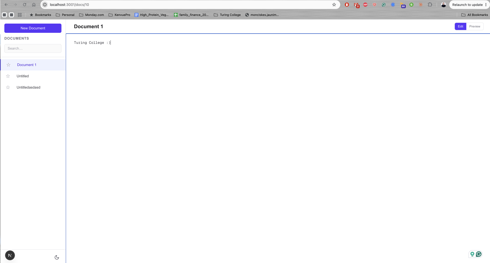

# Document Management

A simple, private workspace for creating and managing documents. Everything is stored locally in your browser — no account, no server, no internet connection required.

## What it does

- Create, edit, and delete documents from a persistent sidebar
- Write in Markdown with a live Preview toggle
- Star documents to pin favourites to the top of the list
- Search documents by title as you type
- Switch between light and dark themes — preference is remembered across reloads
- Fully keyboard-navigable with visible focus indicators (WCAG 2.1 AA)
- Responsive layout: sidebar-first on mobile, side-by-side on desktop

## Screenshot



> Replace `screenshot.png` with an actual screenshot saved to the project root.

## How to run locally

```bash
npm install
npm run dev
```

Open [http://localhost:3000](http://localhost:3000). If port 3000 is taken, Next.js will use the next free port — check the terminal output for the exact URL.

## Optional tasks completed

**Starred documents** — a star button on each document in the sidebar pins favourites to the top of the list. Starred state is stored in IndexedDB alongside the document content and persists across reloads.

**Dark-mode toggle** — a sun/moon button in the sidebar footer switches the app between light and dark themes. The choice is saved in `localStorage` via `next-themes` and restored on every page load.

## Stack

- Next.js 16 (App Router)
- TypeScript
- Tailwind CSS v4
- Dexie.js (IndexedDB)
- next-themes
